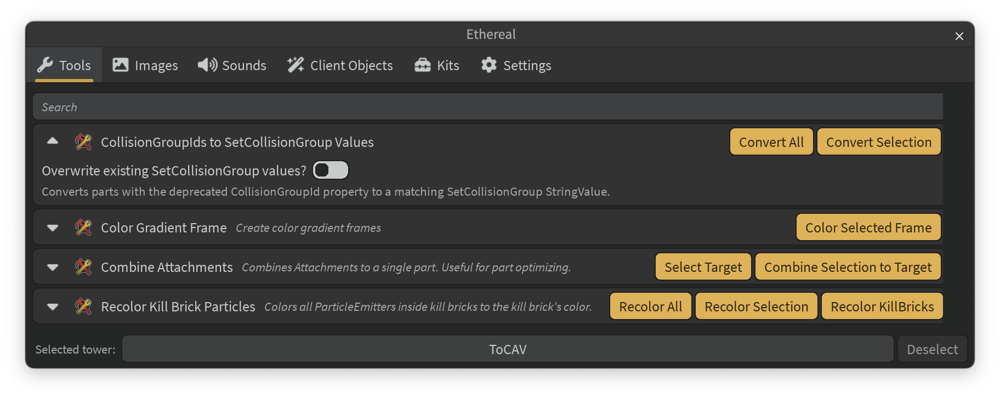

# Tour of Ethereal

To start, let's create a tower using the Ethereal plugin. You'll see how
everything looks together, but you aren't expected to understand everything
right away.

!!! warning "...but first, something important:"

    ETHEREAL IS UNRELEASED, UNFINISHED, AND UNTESTED. DO NOT USE IT TO BUILD
    TOWERS YET.

## Setup

1.  Open a fresh baseplate in Roblox Studio.

2.  Check you have the Ethereal plugin installed. Click on the Plugins tab, and
    check for the "Launch Ethereal" button:

    

3.  Click "Launch Ethereal" to open the plugin widget. It's recommended to dock
    it below your viewport:

    

## Using Kits

!!! warning "This section isn't technically implemented yet"

Ethereal comes with tower kits. For now, let's use the standard Eternal Towers
of Hell version 5.5 kit.

1.  Click on the "Kits" menu.

2.  Click on the Eternal Towers of Hell category and scroll down for version 5.5.

3.  Click on it to insert the kit.

The Eternal Towers of Hell kit should be inserted and ready to be used!

!!! warning "Due to plugin API limitations, you will need to configure the game:"

    - Setting Lighting technology
    - Setting character model from R15 to R6
    - Setting Workspace.PhysicsSettingMethod to Fixed

## Using Ethereal Tools

!!! warning "This section isn't feature implemented yet"

Ethereal offers a range of tools to enhance your workflow. Let's use the
"Color Gradient Frame" tool to switch up the standard frame gradient.

<!-- TODO: should this be automated when inserting new towers? -->

1.  In the Explorer widget, select the folder containing your EToH v5.5 kit.

2.  Navigate to the "Tools" menu within the Ethereal plugin.

3.  Find the "Color Gradient Frame" tool. This tool colors frames based on a
    defined gradient. Use the search box if convenient.

4.  Click on the caret arrow to expand the tool.

5.  Click on the gradient next to "Frame Gradient". Adjust the gradient with the
    new menu, and click OK once finished:

6.  Now that you've set the gradient, click the gold "Color" button:

7.  The frame should now be colored:

Tools are very handy and help eliminate tedious parts of your everyday tower
building.

!!! tip "Starring Tools"

    If you'd like, click the Star next to "Color Gradient Frame" to pin it at
    the top for quick access.

---

With that, you've created a new tower using all of the major Ethereal features!
