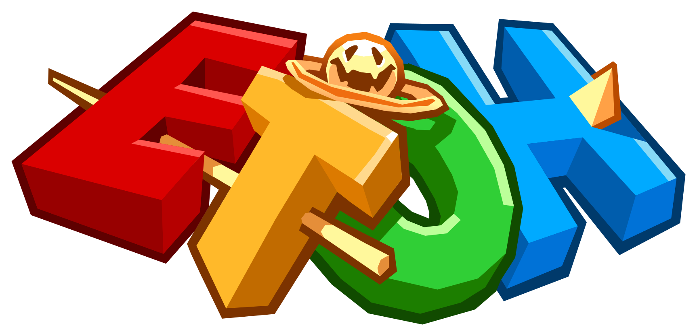
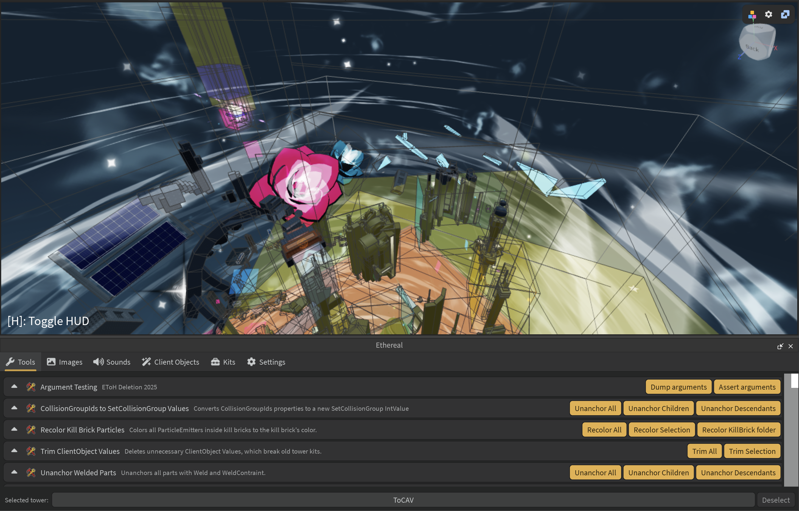

<h1 style="display: none;">Home</h1>

<main class="ethereal-home">
<h1>
Full-featured  companion plugin.
</h1>

    Ethereal is an all-in-one building plugin for Eternal Towers of Hell. The
    mission is to consolidate utilities for tower building and provide a
    centralized, up-to-date foundation for future work.

<a class="ethereal-button ethereal-button-primary">
    Download on Roblox
</a>

<small>Featured tower: Tower of Complexity and Volatility</small>

</main>
